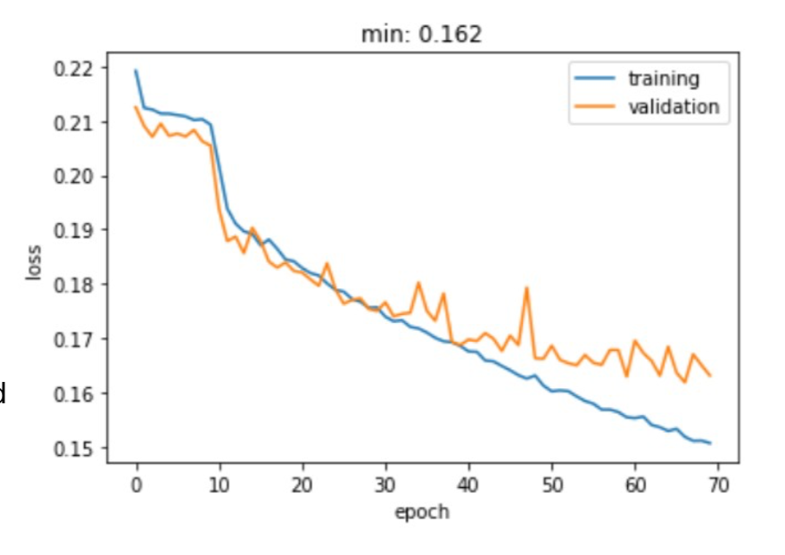
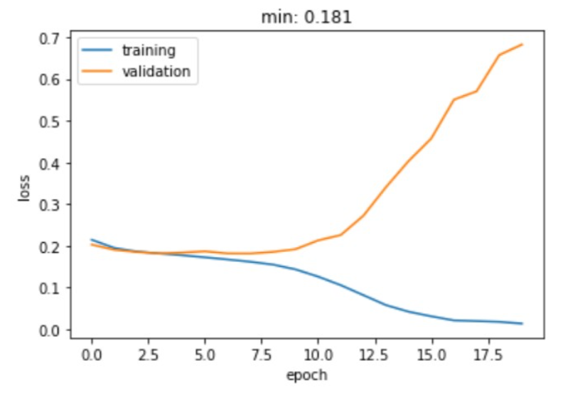

# Image recognition with deep learning methods

## Problem
The task is to learn to assign the correct labels to a set of images.  The images are originally from a photo-sharing site and released under Creative Commons-licenses allowing sharing.  The training set contains 20 000 images. We have resized them and cropped them to 128x128 to make the task a bit more manageable.

One image may belong to many classes in this problem, i.e., it's a multi-label classification problem. In fact there are images that don't belong to any of our classes.

## Solution

### Preprocessing and transformations of data
We are using One-Hot encoding for multi-label classification over all classes.

We have tried using data augmentation to have more varied input data, but this did not change our results significantly. It is not present in our final model anymore.

However, what we have tried is random changing of color attributes, random cropping, horizontal and vertical flipping transformations, grayscale transformation and random rotation.
The only remaining transformation is data normalization.
We split the data into a training and testing/validation set with traditional 0.8-0.2 proportions. The training data is shuffled after each epoch.

While creating data loaders for training and testing, we specify the mini batch size as 64 (in the end). We have tried different batch sizes, but results looked similar.

### Final network
The final network is built with subsequent layers as follows:
1. 2D 3x3 convolutional layer with 20 feature maps with ReLU activation + Max Pooling
2. 2D 3x3 convolutional layer with 40 feature maps with ReLU activation + Max Pooling
3. 2D 1x1 convolutional layer with 20 feature maps with ReLU activation (NO pooling)
4. 2D 5x5 convolutional layer with 50 feature maps with ReLU activation + Max Pooling
5. 2D 7x7 convolutional layer with 100 feature maps with ReLU activation + Max
Pooling
6. Flattening the output of convolution
7. Fully connected layer with output size 2048 with ReLU activation
8. Fully connected layer with output size 512 with ReLU activation
9. Fully connected layer with output size 14

The loss function used is binary cross entropy combined with sigmoid function leveraging log-sum-exp trick. Eventually we used the Adam optimizer, other optimizers did not perform significantly different. Furthermore we use L2 regularization.

The training loss we obtained with this network is shown in the plot on the right.

After almost 70 epochs, we have obtained the minimum 0.162 loss on validation data, F-score goes up to 0.45 during training. As we can see, the validation error decreases with the decrease of training error – our network learns good generalized properties.

### Parameters optimization process
While looking for a good properties of network, we developed a large amount of nets with different convolution/kernel sizes and depths, also using different strides.

The first thing we noticed was that regularization is crucial to obtain good results. Below is a plot of training and validation losses for one of our nets without using L2 generalization. It shows that the network barely learns anything.

After finding a network architecture that performed well on the data, we tried different output dimensions for the convolutional and fully connected layers. After several iterations we ended up with a well-performing net, using the parameters described above. Especially the 1x1 convolution for dimensionality reduction enabled us to have greater depth while not worsening the loss. Deeper or ‘shallower’ nets did not perform as well as the one presented above.

Only one fully connected layer did not yield very good results. We ended up using three. More fully connected layers didn’t help with overfitting but helped us finetune the network to reach a smaller loss.

With each net we tried some different learning rates and weight decays (for the regularization). With our final, best, net, we found a learning rate of 0.0005 and weight decay of 0.0002 to work best. Higher or lower values performed worse. All these tests were conducted by plotting training and validation loss as seen in above plots. We also studied how the F1-Scores on the test data changed over the epochs.

Here is a short summary of different hyperparameters we tried:
- Different optimizers: Adam, Adagrad, Stochastic Gradient Descent. All of them had similar performance, Adam was slightly the best one.
- Different batch sizes (16, 32, 64, 128) did not have a major influence on performance. We opted for 64 since it’s still fast but does not consume a lot of memory.
- For the loss function we tried to adjust the parameter pos_weight, to account for class imbalances in the data. This change however resulted in higher losses and lower F1-Scores, so we decided not to use it.
